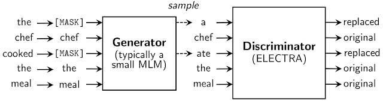

# IndoELECTRA
IndoELECTRA: Pre-Trained Language Model for Indonesian Language Understanding

## Overview

[ELECTRA](https://openreview.net/pdf?id=r1xMH1BtvB) is a new method for self-supervised language representation learning. This repository contains the pre-trained Electra Base model (tensorflow 1.15.0) trained in a Large Indonesian corpus (~16GB of raw text | ~2B indonesian words). 

According to the [author's description](https://ai.googleblog.com/2020/03/more-efficient-nlp-model-pre-training.html):
> Inspired by generative adversarial networks (GANs), ELECTRA trains the model to distinguish between “real” and “fake” input data. Instead of corrupting the input by replacing tokens with “[MASK]” as in BERT, our approach corrupts the input by replacing some input tokens with incorrect, but somewhat plausible, fakes. For example, in the below figure, the word “cooked” could be replaced with “ate”. While this makes a bit of sense, it doesn’t fit as well with the entire context. The pre-training task requires the model (i.e., the discriminator) to then determine which tokens from the original input have been replaced or kept the same.

## Requirements
* Python 3
* TensorFlow 1.15 (although we hope to support TensorFlow 2.0 at a future date)
* NumPy
* scikit-learn and SciPy (for computing some evaluation metrics).

All models are trained using same tokenizer as BERT, BERT Tokenizer. 
Vocabulary file are built using WordPiece Library

## Training

Please follow the root [repository](https://github.com/google-research/electra) for training model.
